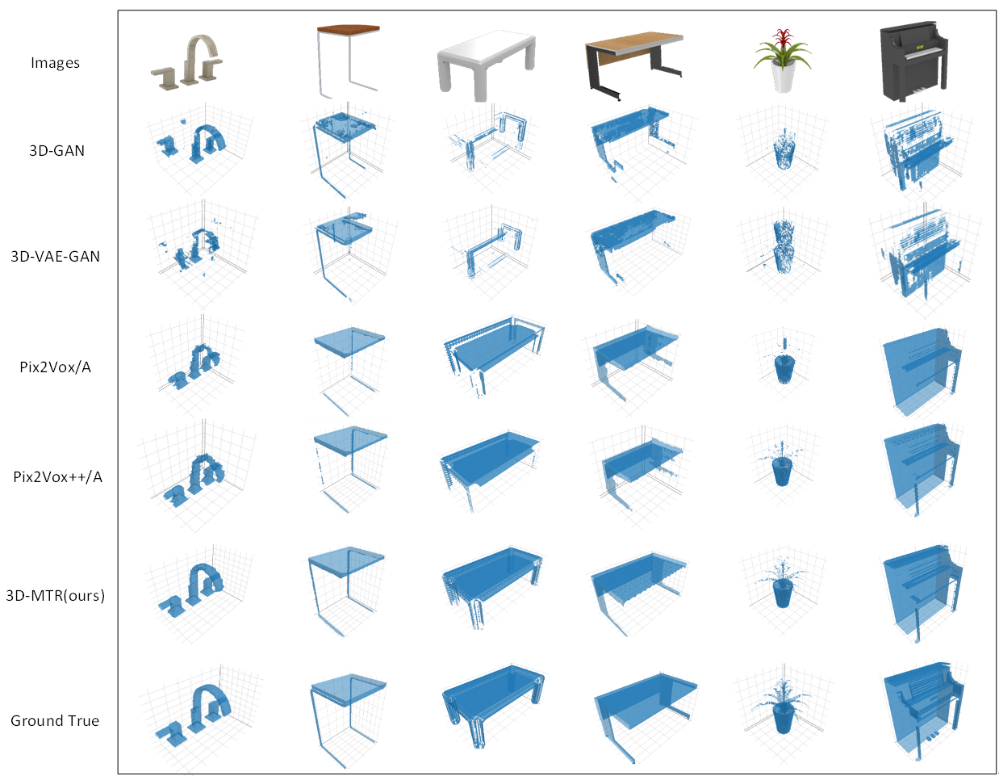

# PyTorch implementation of 3D-MTR(3D Masked Transformer Reconstruction)

This repository contains the source code for the paper "3D-MTR: A 3D Reconstruction Algorithm for Deep Understanding of Images"  


#### Author email: gaotong_dream@foxmail.com    


  

figure of data distribution 

  


## Datasets
We use the renderings of [ShapeNet](https://www.shapenet.org/) in our experiments,which are available below:
- ShapeNet rendering images: https://www.shapenet.org/

## Model Structure


## Prerequisites
#### Clone the Code Repository

```
git clone https://github.com/clfs0003/3D-MTR
```
#### Install Python Denpendencies

```
cd UAGAN
pip install -r 3D-MTR_requirements.txt
```
#### Update Settings in `config.py`

You need to update hyperparametersthe of the model and path of the datasets :
```
    parser.add_argument('--image_dir', type=str, default='./dataset/img', help='input RGB image path')
    parser.add_argument('--mask_dir', type=str, default='./dataset/mask', help='input mask path')
    parser.add_argument('--lr', type=float, default='0.0002', help='learning rate')
    parser.add_argument('--batch_size', type=int, default='5', help='batch_size in training')
    parser.add_argument("--epoch", type=int, default=600, help="epoch in training")

```
## Part of the experimental results are as follows

###results of ShapeNet:



###results of Reapir Net in ShapeNet:


###results of MAE in ShapeNet:


## Get Started
To train 3D-MTR, you can simply use the following command:

```
python3 main_repair.py 
python3 main_rec.py 
```

Note:
Since our paper has not been published yet, we only show the model structure and training code. When the paper is published, we will publish the full work of the paper.
Welcome scholars to discuss and exchange.

## License

This project is open sourced under MIT license.
